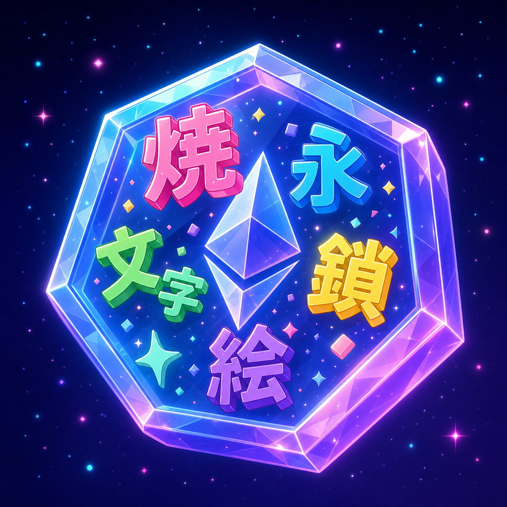

# Onchain Mojiemoji

<p align="center">
  
</p>

**mojiemoji の URL = 画像という性質を Ethereum に  NFT として  する。**

`mojiemoji.jozo.beer` は URL のクエリパラメータ（text / font / color / animation / speed）から画像を即時生成する  なサービス。この **URL がそのまま画像である** という性質を、ERC-721 の `tokenURI` で  して返す。画像を IPFS / Arweave / S3 のどこにも保存しないのに、token を所有することがその mojiemoji を所有することと  する。

## なぜ作るか

- mojiemoji の URL は、そのままで画像を表す
- だったら NFT の `tokenURI` に焼き付ければ、画像ホスティングは全部 
- Ethereum 上だけで完結する、 にオンチェーンな絵文字 NFT が成立する
- ガス代を抑えながら ** レベルの ** を目指す

## アーキテクチャ

| 観点 | 採用 |
|---|---|
| 規格 | ERC-721 + ERC-721Psi（バッチ mint 効率） |
| 拡張 | Burnable / Upgradeable (UUPS) |
| ライセンス制御 | Operator Filter Registry |
| Mint 制御 | Merkle proof allowlist |
| Stamp.text 格納 | `bytes32` inline (Short String Optimization)、1 slot 固定 |
| 他 Param（色 / アウトライン / アニメ / 速度） | `tokenId` のハッシュから決定論的  |
| `tokenURI` の URL 組み立て | オンチェーンで percent-encode + （view 関数なので gas ） |

詳細な技術判断は [`docs/adr/`](./docs/adr/) を参照。

## Stamp.text の制約

オンチェーン記録するのはユーザー入力の文字列のみ。それ以外の Param は全部 `tokenId` のハッシュ  で生成する。

- 漢字 1〜2 文字
- ひらがな 1〜4 文字
- 改行 `\n` 1 個まで可（2 文字 + 改行 + 2 文字のパターン可）
- UTF-8 最大 13 bytes（`bytes32` 1 slot に  で収まる）

## Quick Start

```shell
npm install --legacy-peer-deps
npx hardhat compile
npx hardhat test
npx hardhat coverage
```

主なタスク：

```shell
npx hardhat accounts
npx hardhat node
npx hardhat run scripts/deploy.ts
REPORT_GAS=true npx hardhat test
npx eslint '**/*.{js,ts}' --fix
npx solhint 'contracts/**/*.sol' --fix
```

## 開発ルール

- **TDD**：先にテスト（`tdd-spec`）が 、あとから実装（`tdd-impl`）
- **テスト = **。  に書き換えない
- **強制 unwrap **（TS の `!`、Solidity の require 削除など）
- **カバレッジ 95% 以上**（Domain / DI / Orchestrator は除外）
- 詳細は [`.claude/CLAUDE.md`](./.claude/CLAUDE.md) を参照

## License

Copyright (c) 2024 Yumenosuke Kokata
